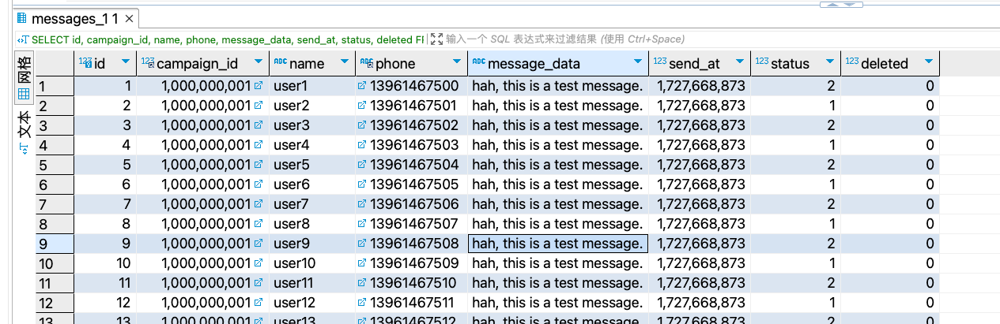

# Messaging Campaign System

This project is a scalable messaging campaign management system designed to handle large-scale messaging using Kafka for message queuing and Go for backend services. The system allows users to create and schedule campaigns, manage recipient lists, and send personalized messages in bulk.

## Table of Contents

## Table of Contents

- [Introduction](#introduction)
- [Features](#features)
- [Installation & Running](#installation--running)
- [Configuration](#Configuration)
- [API Documentation](#api-documentation)
- [Testing](#testing)
- [Todolist](#todolist)


## Introduction

This system is built to support the creation, scheduling, and broadcasting of messaging campaigns using Kafka for queuing and Go for backend processing. The platform enables large-scale message delivery to recipients from a CSV file containing their phone numbers and names, with customizable message templates.


## Features

List the main features of the project:

- Create and schedule messaging campaigns
- Import recipient lists from CSV files
- Generate and queue personalized messages for delivery
- Kafka-based message queuing for high throughput
- Consumer service for processing and simulating message delivery
- MySQL for campaign and recipient data storage

## Installation & Running

### Prerequisites

Make sure the following tools are installed:

- [Go 1.23.1](https://golang.org/doc/install)
- [MySQL 8.0+](https://dev.mysql.com/downloads/mysql/)
- [Kafka 2.8.0+](https://kafka.apache.org/downloads) (with Zookeeper)

### Running Locally

1. Install and start mysql:
    ```bash
    brew install mysql
    brew services start mysql
    ```
2. Install, start and config kafka:
    ```bash
    brew install kafka
    brew services start kafka
3. Config kafka:
     ```bash
     kafka-topics --create --topic Sync-Msg-T --bootstrap-server 127.0.0.1:9092 --partitions 2 --replication-factor 1
     #kafka-topics --list --bootstrap-server 127.0.0.1:9092
     #kafka-topics --describe --topic Sync-Msg-T --bootstrap-server 127.0.0.1:9092
     #kafka-consumer-groups --describe --group Msg-Consumer-G --bootstrap-server 127.0.0.1:9092
     #kafka-topics --alter --topic Sync-T --bootstrap-server 127.0.0.1:9092 --partitions 4
     #kafka-consumer-groups --describe --group Msg-Consumer-G --bootstrap-server 127.0.0.1:9092
4. Install mysql scripts:
    ```bash
    cd camp-mgr/app/deploy
    ./install_camp_db.sh
    ```
   
5. Install dependencies:
    ```bash
    go mod tidy
    ```   

6. Run the service as a producer only:
    ```bash
    cd /camp-mgr/app/campmgr/cmd
    go run main.go -c ../etc/campmgr.yaml
    ```
7. Run the service as producer and consumer:
    ```bash
    cd /camp-mgr/app/campmgr/cmd
    go run main.go -c ../etc/campmgr.yaml -w
    ```

The service will be running at `http://localhost:10001`.

## Configuration

```yaml
Name: camp-mgr                # Service name
Host: 0.0.0.0                 # Listen on all IP addresses
Port: 10001                   # Service port
Timeout: 120000               # Request timeout (milliseconds)

Mysql:                        # MySQL configuration
   Addr: 127.0.0.1:3306       # MySQL address and port
   DSN: root:123456@tcp(127.0.0.1:3306)/camp?&parseTime=true&charset=utf8mb4  # Data source name
   Active: 64                 # Maximum active connections
   Idle: 64                   # Maximum idle connections
   IdleTimeout: 4h            # Idle connection timeout
   QueryTimeout: 5s           # Query timeout
   ExecTimeout: 5s            # Execution timeout
   TranTimeout: 5s            # Transaction timeout

SyncClient:                   # Sync client configuration
   Topic:   "Sync-Msg-T"      # Kafka topic to send messages
   Brokers:                   # List of Kafka broker addresses
      - 127.0.0.1:9092

SendClient:                   # Send client configuration
   Topics:                    # List of Kafka topics to send messages
      - "Sync-Msg-T"
   Brokers:                   # List of Kafka broker addresses
      - 127.0.0.1:9092
   Group: "Msg-Consumer-G"    # Consumer group name

MsgTableShardingSize: 8       # Message table sharding size
```

## API Documentation
//todo

### Example

#### Create campaign

- **URL**: `http://127.0.0.1:10001/v1/camp/create`
- **Method**: `POST`
- **Request Body**:
    ```json
    {
    "campaign_name": "game0",
    "campaign_id": 1000000000,
    "message_template": "hi, this is a test message.",
    "scheduled_time": 1727351999,
    "csv_file_path": "recipients.csv"
    }
    ```
- **Response**:
    ```json
    {
    "code": 0,
    "msg": "success"
    }
    ```


## Todolist
1. Unit test code 
2. Support API document, eg. go-swagger
3. Optimize MySQL queries for better efficiency
4. Use memory pools to optimize frequent memory allocations
5. Use a goroutine pool to optimize frequent task starts

